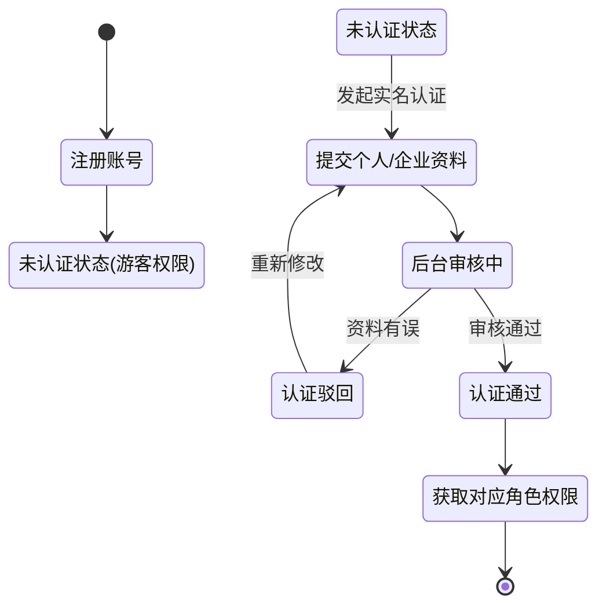
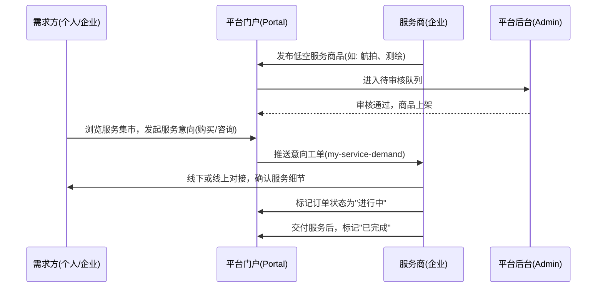
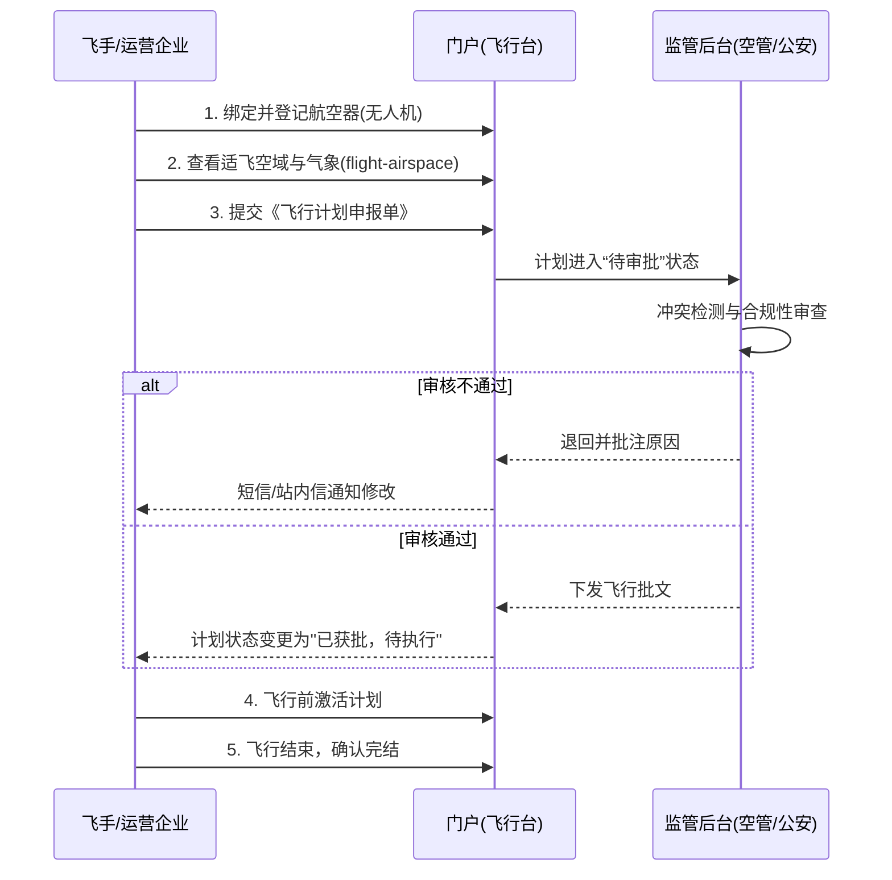

# 区域低空公共服务管理体系 - 产品交付方案 (PRD)

本方案旨在为研发团队提供清晰的功能全貌、业务流转逻辑、交互规范及架构设计要求，确保“区域低空公共服务平台”在开发落地过程中保持极高的体验标准和业务闭环。

---

## 一、 系统架构与功能矩阵

系统分为**前端门户（Portal）**和**管理后台（Admin）**，通过统一的认证体系进行角色鉴权与物理路由隔离。

### 1. 角色体系 (RBAC)
- **游客 / 未认证用户**：仅可浏览新闻、政策、公开服务和空域信息。
- **个人用户（飞手等）**：可管理个人无人机、申报飞行计划、购买商城服务。
- **商户 / 服务提供商**：除了基础功能外，还可发布低空服务商品、响应客户需求。
- **政府 / 监管部门**：侧重于后台审批（飞行计划、资质审核、航线规划）。

### 2. 核心功能模块矩阵

| 模块大类 | 门户侧功能 (Portal) | 后台侧功能 (Admin) |
| :--- | :--- | :--- |
| **用户中心** | 注册登录、实名认证、资质绑定、商户入驻 | 内部员工管理 (`admin-system-user`)、外部用户管理 (`admin-user`)、角色权限分配 |
| **低空服务集市** | 服务大厅 (`service-list`)、需求发布、服务购买 (`mall-intention`)、我的服务 (`my-service`) | 服务上架审核 (`admin-service`)、商户资质审核 (`admin-cert`)、交易监管 |
| **飞行管理服务** | 空域查询 (`flight-airspace`)、航空器登记 (`register-aircraft`)、飞行计划申报 (`my-flight-plan`) | 空域划设管理 (`admin-airspace`)、飞行计划审批 (`admin-flight-plan`)、航空器备案审批 |
| **资讯与政策** | 行业动态 (`news`)、国家/地方政策解读 (`policy-national`) | 内容发布管理 (`admin-news`/`admin-policy`)、门户轮播图配置 |

---

## 二、 核心业务流转逻辑 (Workflows)

### 1. 角色入驻与认证流转

### 2. 低空服务（商品）交易撮合闭环

### 3. 飞行计划申报与空域使用闭环

---

## 三、 设计与交互规范 (给前端与 UI 的交付标准)

### 1. 视觉基调 (UI/UX)
- **色彩规范**：采用深邃科技蓝 (`#0958d9`) 为主色调，象征天空与安全；辅助色采用活力青/绿色 (`#52c41a`) 表示通过、安全状态。
- **卡片式布局 (Card-based Design)**：门户各模块均采用圆角 (`borderRadius: 16px`) 的悬浮卡片式设计，利用无边框变体 (`variant="borderless"`) 配合柔和的底部阴影 (`box-shadow`) 打造呼吸感和空间感。
- **高斯模糊与毛玻璃 (Glassmorphism)**：在导航栏、弹出层、数据看板等区域，适当加入 `backdrop-filter: blur(10px)` 与半透明背景，提升现代感。

### 2. 交互响应逻辑
- **加载状态 (Loading)**：所有表格加载、表单提交时，必须提供局部 `Skeleton`（骨架屏）或 `Spin`（加载圈）。绝不能出现点击后无反馈的“假死”状态。
- **页面跳转 (Navigation)**：
  - 门户内同模块跳转使用单页路由切换（平滑过渡）。
  - 跨端跳转（如门户跳后台、查看全局导航 SITEMAP）建议使用新标签页，或明确的面包屑导航。
- **空状态 (Empty State)**：当用户无飞行计划、无订单时，必须展示插画级的 `<Empty />` 组件，并配以“去申报”、“去逛逛”的强引导按钮（Call to Action）。

---

## 四、 研发对接与架构建议 (给后端的交付标准)

### 1. 数据隔离与安全性
平台具备典型的多租户/多角色特性，后端接口必须强制实现数据越权校验：
- **横向越权**：个人用户 A 绝不能通过修改 ID 获取到用户 B 的飞行计划或实名资料。
- **纵向越权**：门户端用户调用的接口，决不能拥有修改后台系统配置、绕过审批流程的权限。建议 `api/portal/` 与 `api/admin/` 接口路径物理隔离。

### 2. 状态机管理 (State Machine)
复杂业务（如飞行计划）的状态流转需在后端统一管控。前端仅根据返回的 `status` 字段映射徽标颜色和操作按钮。
*飞行计划状态枚举参考：*
- `0`: 待提交 (Draft)
- `1`: 待审批 (Pending)
- `2`: 已驳回 (Rejected)
- `3`: 已获批-待飞 (Approved & Wait)
- `4`: 飞行中 (In-Flight)
- `5`: 已完结 (Completed)
- `6`: 已取消 (Canceled)

### 3. 组件化开发规范
- 前端应高度复用基于 Ant Design v5 的定制组件。例如将“飞行计划状态标签”、“通用头部导航栏”、“上传附件拖拽区”封装为通用 `Components`。
- 所有遗留的 Ant Design 废弃属性（如 `headStyle`, `bordered={false}`）已在原型设计中规范为 `styles={{ header: {} }}` 及 `variant="borderless"`，研发时请严格遵循 Antd v5 API 文档。
